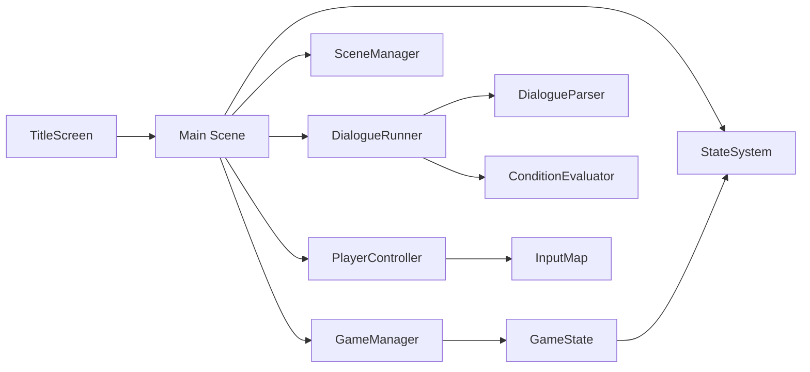

# 都市夜行人 — Urban Night Walker

> 文学微 CRPG — 在雨夜中走过办公室到地铁站的路程，遇到便利店店员、神秘陌生人，面对三个结局。

## 项目状态

| 指标 | 状态 |
|------|:----:|
| 编译 | ✅ 通过 |
| 可运行 | ✅ 能启动 |
| 可玩 | ⚠️ 有标题画面和移动控制，但场景布局和 NPC 交互未完整 |
| 最近构建 | `2026-07-24` |
| 开放 Issues | {N} |

## 架构总览

### 核心系统



### 模块地图

| 模块 | 文件 | 状态 | 设计文档 |
|------|------|:----:|:--------:|
| GameManager | `gdscripts/game_manager.gd` | ✅ | — |
| StateSystem | `gdscripts/state_system.gd` | ✅ | — |
| GameState | `gdscripts/game_state.gd` | ✅ | — |
| SceneManager | `gdscripts/scene_manager.gd` | ✅ | — |
| PlayerController | `gdscripts/player_controller.gd` | ✅ | GDD |
| DialogueRunner | `gdscripts/dialogue_runner.gd` | ✅ | GDD |
| DialogueParser | `gdscripts/dialogue_parser.gd` | ✅ | — |
| SceneBase | `gdscripts/scene_base.gd` | ✅ | — |
| NPCNode | `gdscripts/npc_node.gd` | ✅ | — |
| TextComponentBase | `gdscripts/text_component_base.gd` | ✅ | — |
| TitleScreen | `gdscripts/title_screen.gd` | ✅ | — |

### 数据流

```
玩家输入 → PlayerController → GameManager → StateSystem → 场景/NPC/UI
                                              ↓
                                         DialogueRunner → DialogueParser
                                              ↓
                                        ConditionEvaluator
```

## 关键技术决策

| 决策 | 选择 | 理由 |
|------|------|------|
| 渲染方式 | Label3D + 自定义着色器 | 低多边形文学风格 |
| 对话系统 | JSON 驱动的分支树 | 便于内容迭代和调试 |
| 状态管理 | 单例 GameManager + StateSystem | 简单、可预测 |
| 场景切换 | SceneManager + fade curtain | 平滑过渡 |
| 输入 | Godot InputMap | 标准做法 |

## 已实现功能

| # | 功能 | 状态 | 文档 |
|:-:|------|:----:|:----:|
| 1 | 标题画面 | ✅ 已合并 | — |
| 2 | 玩家角色（CharacterBody3D + WASD） | ✅ 已合并 | GDD |
| 3 | 相机跟随 | ✅ 已合并 | — |
| 4 | 场景空间布局（3D 文字置放） | ✅ 已合并 | — |
| 5 | 测试 NPC + E 键触发对话 | ✅ 已合并 | — |
| 6 | 状态-世界反馈（Hope/Despair） | ✅ 已合并 | — |
| 7 | 场景过渡系统 | ✅ 已合并 | — |
| 8 | 简单结局 | ✅ 已合并 | — |
| 9 | 环境音效 | ✅ 已合并 | — |
| 10 | 输入验证与错误处理 | ✅ 已合并 | — |
| 11 | Fade 遮罩 | ✅ 已合并 | — |
| 12 | MVP 集成测试 | ✅ 已合并 | — |

## 已知问题

| # | 描述 | 优先级 | 状态 |
|:-:|------|:------:|:----:|
| — | 场景过渡触发后玩家位置重置未调试 | medium | 待修复 |
| — | 对话文本在某些场景字体重叠 | low | 待修复 |

> 本文档由 Review Agent 在每次 implement PR 合并后自动更新。
> 最后更新: {date}
